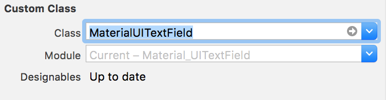
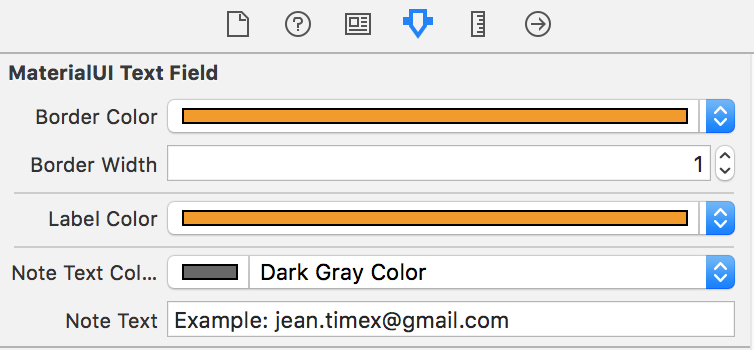
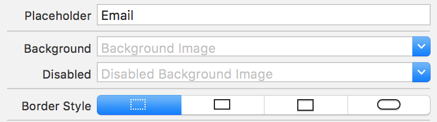

# Material UITextField (Swift)

Another material-style UITextField purely written in Swift 2.0 inspired by [Material-UI](http://www.material-ui.com/).

Rather than using a UIView, this MaterialUITextField extends UITextField so that you can select existing UITextField and apply the new material style.


#### How to use?

**step 1**. Copy the MaterialUITextField.swift to your project.

**step 2**. We need [FontAwesome](https://fortawesome.github.io/Font-Awesome/
), copy fontawesome-webfont.ttf to your project and set it up in Info.plist and Build Phases.

**step 3**. If you use StoryBoard, drag a UITextField to a UIView, change the Class to MaterialUITextField in the Identity inspector.



**step 4**. Go to Attributes inspector, modify the border color, border width, label color, note color and note text.



Alternatively you can set them in code like so:
```javascript
@IBOutlet var emailInput: MaterialUITextField!

emailInput.borderColor = UIColor.darkGrayColor()
emailInput.borderWidth = 1.0
emailInput.labelColor = UIColor.blueColor()
emailInput.noteText = "Example: jean.timex@gmail.com"
emailInput.noteIcon = "\u{f058}" // This is the fontawesome code!
...
```

**step5**. To make it look better, assign a placeholder and change the border to none.



Build and run, enjoy the material UITextField!
